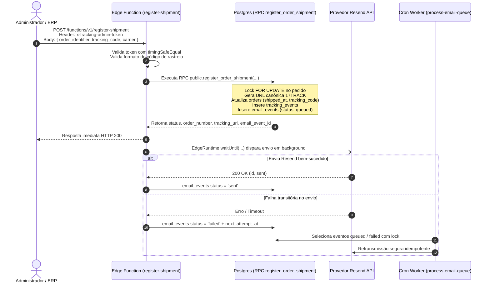

# Guia de Configuração e Operação: Rastreamento e E-mail "Pedido Enviado"

Este documento descreve a arquitetura, autenticação, operação e recuperação de falhas do fluxo manual de despacho e disparo do e-mail transacional **“Pedido enviado”** da PLAUD NOTE Brasil.

---

## 1. Visão Geral da Arquitetura

O fluxo foi desenhado sobre três pilares de confiabilidade: **atomicidade**, **idempotência estrita** e **tolerância a falhas (Outbox Pattern)**.



---

## 2. Variáveis de Ambiente e Secrets

As seguintes secrets devem estar configuradas no Supabase Edge Functions:

| Variável | Obrigatória | Descrição |
| :--- | :--- | :--- |
| `TRACKING_ADMIN_TOKEN` | Sim | Token secreto de alta entropia para autenticar chamadas administrativas à Edge Function `register-shipment`. |
| `RESEND_API_KEY` | Sim | Chave de API de envio do Resend (`re_...`). |
| `RESEND_FROM_EMAIL` | Sim | Remetente verificado (ex: `PLAUD NOTE <pedidos@plaudai.site>`). |
| `RESEND_REPLY_TO_EMAIL` | Sim | E-mail de atendimento para respostas diretas (ex: `suporte@plaudai.site`). |
| `EMAIL_SENDING_ENABLED` | Não | Flag `"true"` ou `"false"` (Kill switch). Se falso, os e-mails são enfileirados mas não transmitidos. |

---

## 3. Como Cadastrar um Rastreamento (Operação Manual / cURL)

### Requisição de Cadastro

```bash
curl -X POST "https://<PROJECT-REF>.supabase.co/functions/v1/register-shipment" \
  -H "Content-Type: application/json" \
  -H "x-tracking-admin-token: <SEU_TRACKING_ADMIN_TOKEN>" \
  -d '{
    "order_identifier": "VCS1O8WQ3EI",
    "tracking_code": "NL123456789BR",
    "carrier": "Correios",
    "replace_existing": false
  }'
```

### Parâmetros Suportados

| Campo | Tipo | Obrigatório | Descrição |
| :--- | :--- | :--- | :--- |
| `order_identifier` | `string` | Sim | Número do pedido (`order_number`) ou código da Vega (`vega_order_id`). |
| `tracking_code` | `string` | Sim | Código de rastreamento (6 a 50 caracteres alfanuméricos). |
| `carrier` | `string` | Não | Nome da transportadora (ex: `"Correios"`, `"Jadlog"`, `"Azul Cargo"`). |
| `replace_existing` | `boolean` | Não | Padrão `false`. Se `true`, permite sobrescrever um código de rastreamento já cadastrado. |

---

## 4. Códigos de Retorno HTTP e Tratamento de Erros

| Status HTTP | Campo `status` / `error` | Significado |
| :--- | :--- | :--- |
| **200 OK** | `"registered"` | Rastreamento cadastrado com sucesso e e-mail enfileirado/disparado. |
| **200 OK** | `"already_registered"` | O mesmo código já estava cadastrado para este pedido (operação idempotente). |
| **200 OK** | `"replaced"` | Código anterior foi substituído (quando `replace_existing: true`). |
| **400 Bad Request** | `"Invalid input parameters"` | Código de rastreio com caracteres inválidos ou parâmetros faltando. |
| **401 Unauthorized** | `"Unauthorized"` | Header `x-tracking-admin-token` ausente ou incorreto. |
| **404 Not Found** | `"Order not found"` | Nenhum pedido localizado com o identificador fornecido. |
| **409 Conflict** | `"Order cannot be shipped..."` | Pedido ainda não está com pagamento aprovado (`paid`) ou foi cancelado. |
| **409 Conflict** | `"tracking_conflict"` | Pedido já possui outro código cadastrado e `replace_existing` não foi enviado como `true`. |
| **500 Internal Server** | `"Database execution failed"` | Falha de infraestrutura interna ou configuração ausente. |

---

## 5. Garantias de Idempotência e Segurança

1. **Proteção contra Timing Attacks**: A autenticação do token utiliza hashes SHA-256 e `timingSafeEqual`.
2. **URL Canônica da 17TRACK**: A URL de rastreamento é gerada de forma determinística no formato:
   `https://www.17track.net/pt?nums=<TRACKING_CODE>`
3. **Idempotência no Resend**: O cabeçalho `Idempotency-Key` é enviado como:
   `order-shipped/<order_id>/<tracking_code>`
   Garantindo que mesmo sob retentativas de rede, o cliente nunca receba e-mails duplicados para a mesma remessa.
4. **Zero Trust no Payload**: Campos críticos como `customer_id`, `email`, `status`, `tracking_url` não são aceitos no corpo da requisição e são sempre buscados ou gerados diretamente no banco de dados.
